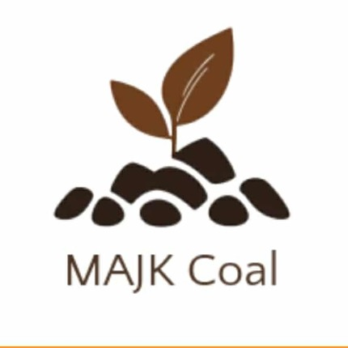

<section>
  

    

  

</section>
<head>
  <meta charset="UTF-8">
  <title>MAJK Eco-Briquettes</title>
  <meta name="viewport" content="width=device-width, initial-scale=1.0">
  
</head>
<body>

<<header>
  
  <h1>MAJK Eco-Briquettes</h1>
  
Burn Smart. Save More.

</header>

<section>
  

    <h2>What We Do</h2>
    
We turn organic waste into affordable and clean fuel for households and small food businesses.

  

  

    <h2>Why Choose Us</h2>
    <ul>
      <li>Lower cost than charcoal</li>
      <li>Longer burning time</li>
      <li>Less smoke, cleaner cooking</li>
      <li>Environmentally sustainable</li>
    </ul>
  

  

    <h2>Target Market</h2>
    
Households, carinderias, BBQ stalls, and small food businesses.

  

 

  <h2>Order Now</h2>
  
Message or call us today and start saving with eco-friendly fuel.

  
<b>📞 Phone:</b> 0927-113-1690

  
<b>📘 Facebook:</b> 
    <a href="https://facebook.com/YOURPAGE" target="_blank">
      MAJK Eco-Briquettes
    </a>
  

  <a href="https://www.facebook.com/kenneth.busante2003" class="btn" target="_blank">
    Message Us on Facebook
  </a>

</section>

<footer>
  
© 2025 MAJK Eco-Briquettes — From Waste to Worth

</footer>

</body>
</html>
